# laboratorio-git

## Comandos usados

git init
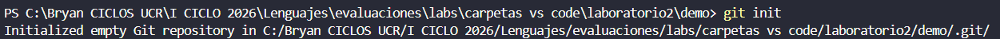
git branch -M main
git add .
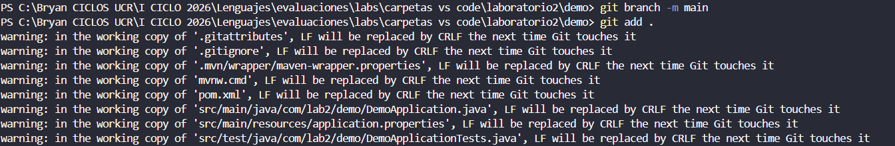
git commit -m "Estructura inicial del proyecto"
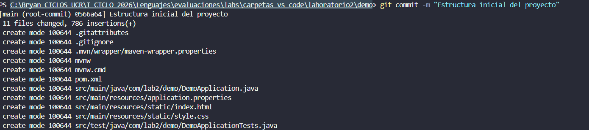
git log --oneline

git checkout -b desarrollo
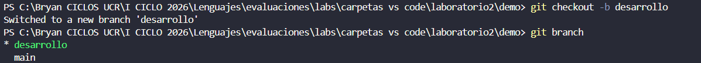
git commit -m "Agrega contenido en index"
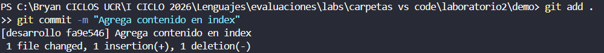
git checkout main
git merge desarrollo
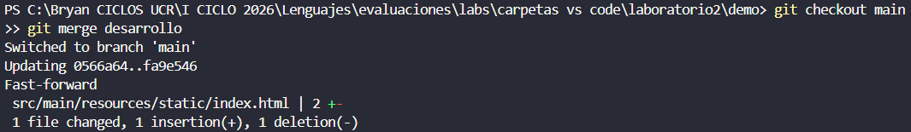
git diff
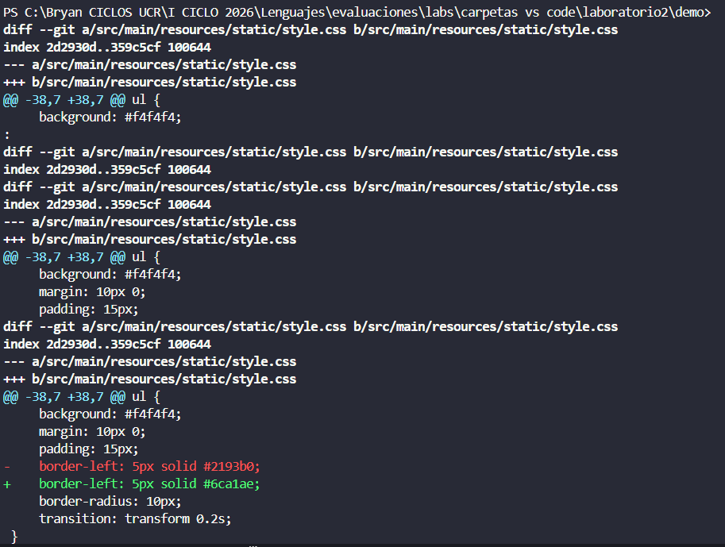
git commit -m "Cambio temporal"
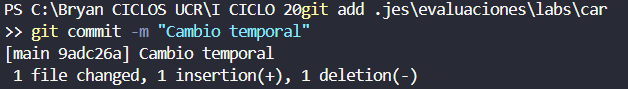
git reset --hard HEAD~1
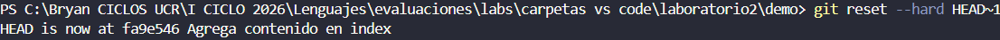
git reflog
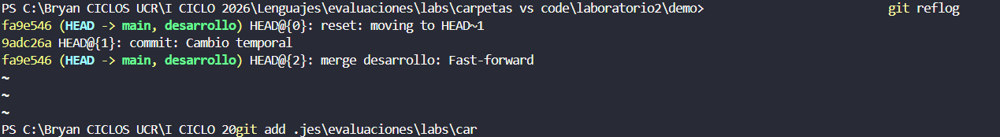
git reset --hard 9adc26a
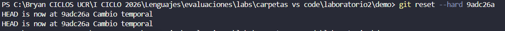
git add .
git commit -m "Agrega gitignore"
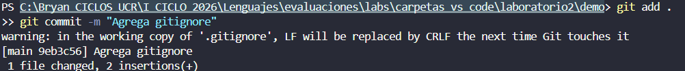
git remote add origin https://github.com/bryanguti1706-crypto/laboratorio-git.git
git pull origin main --allow-unrelated-histories
git push -u origin main
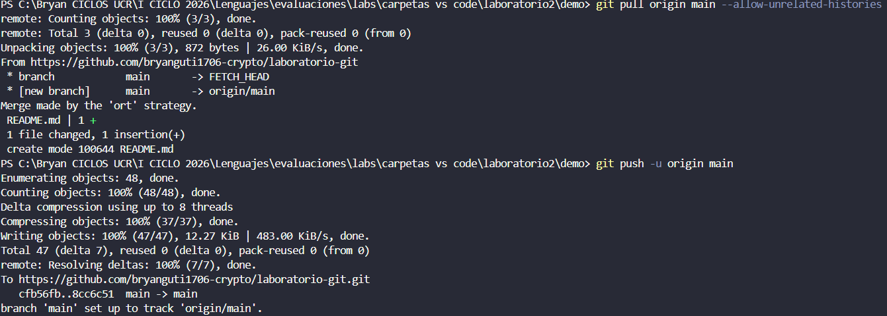
git checkout -b login
git commit -m "Agrega login"
git push -u origin login
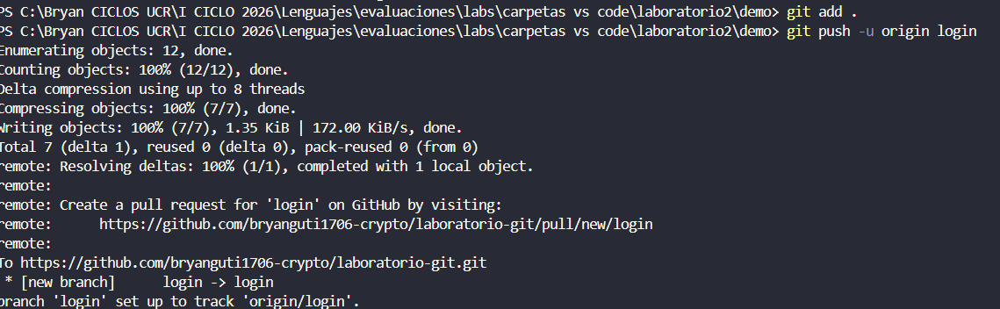